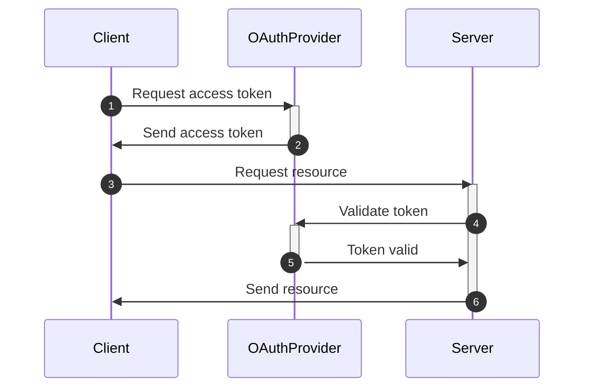

```mermaid
sequenceDiagram
autonumber
    participant Client
    participant OAuthProvider
    participant Server
    Client ->> OAuthProvider: Request access token
    activate OAuthProvider
    OAuthProvider ->> Client: Send access token
    deactivate OAuthProvider
    Client ->> Server: Request resource
    activate Server
    Server ->> OAuthProvider: Validate token
    activate OAuthProvider
    OAuthProvider->>Server: Token valid
    deactivate OAuthProvider
    Server ->> Client: Send resource
    deactivate Server
```
