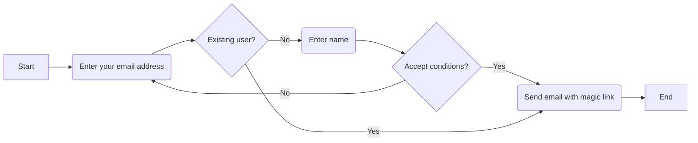
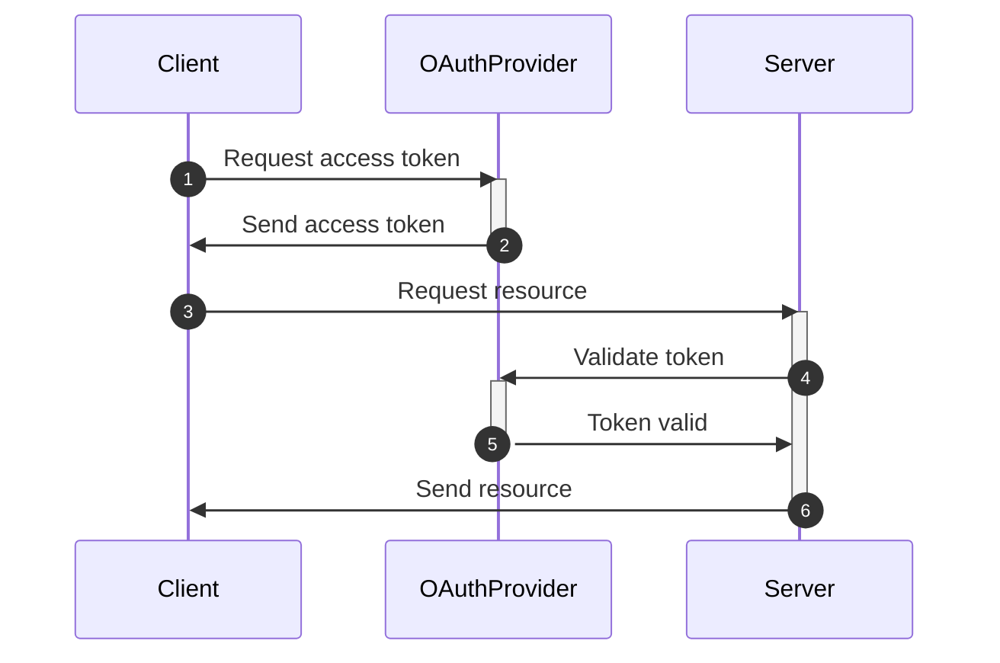
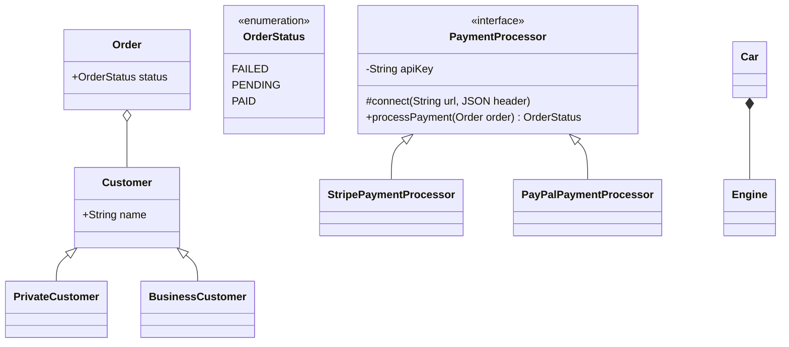
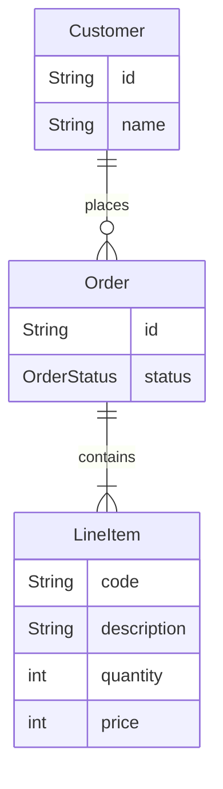

# Mermaid

Extension: Markdown Preview Mermaid Support.
Mermaid live editor: https://mermaid.live
CheatSheet: https://jojozhuang.github.io/tutorial/mermaid-cheat-sheet/

1. Flowchart

2. SequenceDiagram

3. ClassDiagram

4. EntityRelationshipDiagram
